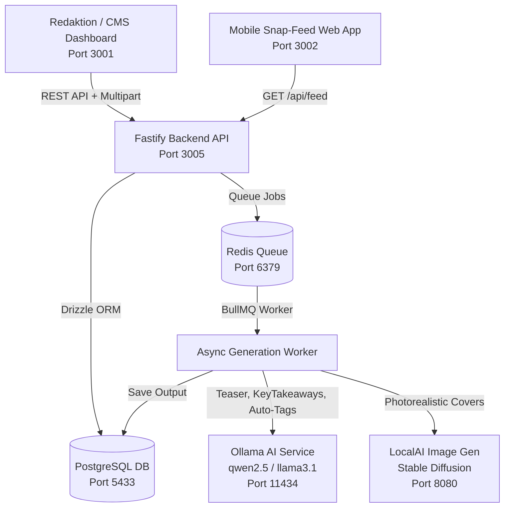

# KI-gestützte News-Distribution

> **Diplomarbeit HTL Leonding (Abteilung Informatik)**  
> Automatisierte Content-Aufbereitung und modulare Bereitstellung von Short-Form-Inhalten für moderne Medienkonsumenten.

---

## 👥 Autoren & Aufgabenbereiche

* **David Windischbauer** (`@dwindischbauer`)
  * **E-Mail**: `d.windischbauer@students.htl-leonding.ac.at`
  * **Schwerpunkte**: Backend-Architektur (Fastify), Drizzle ORM Schema & PostgreSQL Migrationen, BullMQ Queue & Worker-Prozesse, Ollama Integration (KI-Teaser & Auto-Tagging), LocalAI Stable Diffusion Bild-Pipeline, REST-Schnittstellen.
* **Stefan Schachner** (`@StefanSchachner`)
  * **E-Mail**: `s.schachner1@students.htl-leonding.ac.at`
  * **Schwerpunkte**: Admin CMS Dashboard (Nuxt 4), Mobile Vertical Snap-Feed Web-App (Nuxt 4), Wiederverwendbares `@wb-news/shortform-news` Komponenten-Package, UI/UX Design & Signal Handoff (`postMessage`).

---

## 🏛️ Systemarchitektur



---

## 📁 Repository-Struktur

```
wb-news/
├── apps/
│   ├── admin/                 # Admin CMS Dashboard (Nuxt 4, Port 3001)
│   │   ├── pages/index.vue    # Dashboard, Tabelle, Tag-Filter, Live-Vorschau
│   │   ├── pages/jobs.vue     # BullMQ Job-Monitoring
│   │   └── pages/settings.vue # KI-Modelle & Timeout-Konfiguration
│   ├── api/                   # Fastify REST API Backend (Port 3005)
│   │   ├── src/db/            # Drizzle ORM Schema, Client & Seeds
│   │   ├── src/queue/         # BullMQ Worker Pipeline (Auto-Tagging, Teaser)
│   │   ├── src/routes/        # REST Endpunkte (/articles, /jobs, /tags, /feed)
│   │   └── src/services/      # LocalAI Bild-Prompt-Synthese & Generator
│   └── feed/                  # Mobile Vertical Snap-Feed App (Nuxt 4, Port 3002)
│       └── pages/index.vue    # Vollbild-Kartenansicht mit Reader-Overlay
├── packages/
│   └── shortform-news/        # Wiederverwendbares Nuxt/Vue-3 UI-Package
│       ├── src/components/    # ShortformFeed.vue & ShortformCard.vue
│       └── src/utils.ts       # HTML-Stripping, Tag-Parsing, Lesezeit-Schätzung
├── docker-compose.yml         # Container (Postgres, Redis, Ollama, LocalAI)
└── package.json               # pnpm Monorepo Konfiguration
```

---

## 🚀 Schnellstart & Installation

### 1. Voraussetzungen
* Node.js >= 18.0.0
* pnpm (`corepack enable && corepack prepare pnpm@latest --activate`)
* Docker & Docker Compose

### 2. Docker-Container starten
```bash
docker compose up -d
```
Startet:
* **PostgreSQL 16**: Port `5433` (DB: `wb_newsfeed`, User: `wb_user`)
* **Redis 7**: Port `6379`
* **Ollama**: Port `11434`
* **LocalAI GPU/CPU**: Port `8080`

### 3. Abhängigkeiten installieren & Datenbank migrieren
```bash
# Dependencies installieren
pnpm install

# Datenbank-Schema per Drizzle anlegen
pnpm --filter @wb-news/api run db:push
```

### 4. Lokale Entwicklungs-Server starten
```bash
pnpm run dev
```

Die Dienste sind unter folgenden Adressen erreichbar:
* **Admin CMS**: [http://localhost:3001](http://localhost:3001)
* **Mobile News-Feed**: [http://localhost:3002](http://localhost:3002)
* **Fastify REST API**: [http://localhost:3005](http://localhost:3005)
* **API Health Check**: [http://localhost:3005/api/sysinfo](http://localhost:3005/api/sysinfo)

---

## 🧪 Tests ausführen

Das Projekt verfügt über automatische Tests mit **Vitest**:
```bash
pnpm run test
```

---

## 🛡️ Wichtigste Features

1. **Vollautomatisierte KI-Textveredelung:**
   * Automatische Titelgenerierung (falls im CMS ausgelassen).
   * 3-Satz Social-Media Teaser.
   * Extrahierte Kernpunkte (`keyTakeaways`).
   * **Multi-Tagging:** KI-gestützte Zuordnung passender Schlagwörter (*Innenpolitik, Außenpolitik, Klima & Energie, Finanzen*, etc.).
2. **Kontextuelle Bild-Synthese:**
   * Automatische Erstellung fotorealistischer Nachrichten-Bilder via Stable Diffusion / LocalAI.
   * Spezifische Prompt-Übersetzung basierend auf Schlagwörtern & Titel (Vermeidung von Text-Artefakten im Bild).
   * Drag-and-Drop Bildupload & Bildlöschung im CMS.
3. **Resiliente Hintergrundverarbeitung:**
   * BullMQ Queue mit automatischer Retry-Policy, Exponential Backoff und Dead-Letter-Behandlung.
   * Zuverlässige Bereinigung verwaister Jobs und physischer Bilddateien.
4. **Modulare Komponentenbibliothek:**
   * `@wb-news/shortform-news` als exportiertes Monorepo-Package mit Vollbild-Snap-Scrolling, Impression-Tracking und Reader-Overlay.
