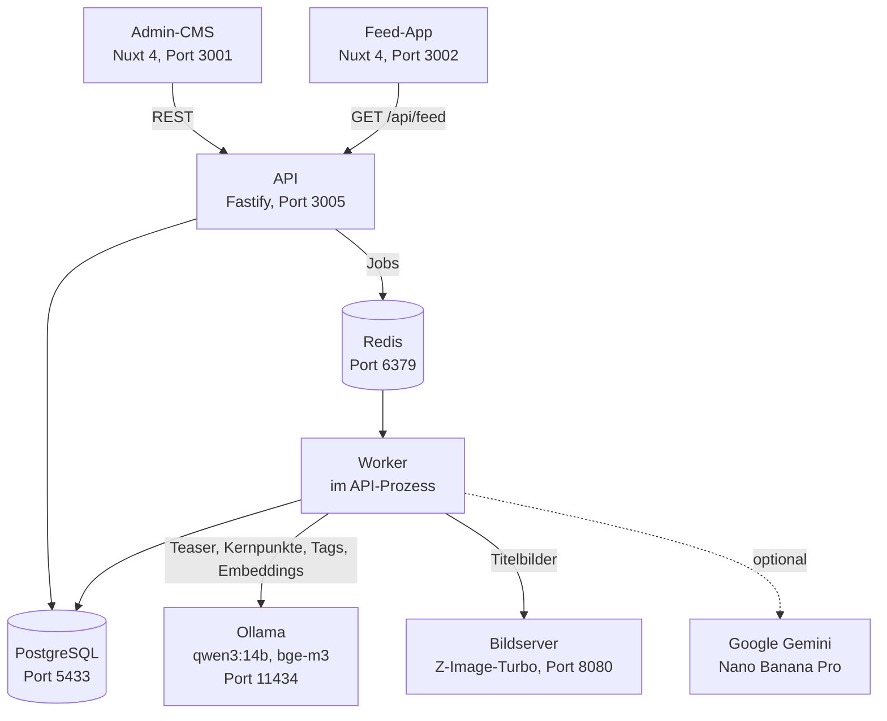

# wb-newsfeed

Diplomarbeit an der HTL Leonding, Abteilung Informatik:
**KI-gestützte News-Distribution** – automatisierte Aufbereitung von Nachrichtenartikeln
und modulare Bereitstellung als Short-Form-Feed.

Aus einem normalen Artikeltext entstehen automatisch ein kurzer Teaser, Kernpunkte, Schlagwörter
und ein Titelbild. Die Artikel erscheinen in einem vertikalen Feed zum Durchwischen, der als
Nuxt-Komponente in bestehende Websites eingebaut werden kann.

## Team

| Name | Schwerpunkt |
|---|---|
| David Windischbauer (`@dwindischbauer`, d.windischbauer@students.htl-leonding.ac.at) | Backend: Fastify-API, Datenbank (Drizzle, PostgreSQL), Queue und Worker (BullMQ), Textgenerierung und Embeddings mit Ollama, Bildserver, RSS-Import, API-Dokumentation |
| Stefan Schachner (`@StefanSchachner`, s.schachner1@students.htl-leonding.ac.at) | Frontend: Feed-App, Admin-CMS (beide Nuxt 4), Komponenten-Package `@wb-news/shortform-news`, UI-Design, Einbindung in fremde Seiten |

## Aufbau


```mermaid
graph TD
    A[Admin-CMS<br/>Nuxt 4, Port 3001] -->|REST| B[API<br/>Fastify, Port 3005]
    C[Feed-App<br/>Nuxt 4, Port 3002] -->|GET /api/feed| B
    B --> D[(PostgreSQL<br/>Port 5433)]
    B -->|Jobs| E[(Redis<br/>Port 6379)]
    E --> F[Worker<br/>im API-Prozess]
    F -->|Teaser, Kernpunkte, Tags, Embeddings| G[Ollama<br/>qwen3:14b, bge-m3<br/>Port 11434]
    F -->|Titelbilder| H[Bildserver<br/>Z-Image-Turbo, Port 8080]
    F -.->|optional| I[Google Gemini<br/>Nano Banana Pro]
    F --> D
```

Abläufe, Datenmodell und Details zur Bildgenerierung: [`docs/architektur.md`](docs/architektur.md).

```
wb-newsfeed/
├── apps/
│   ├── admin/                 Admin-CMS: Artikel, Bilder, Versionen, Jobs, Einstellungen
│   ├── api/                   REST-API, Worker, Datenbankschema, openapi.yaml
│   └── feed/                  Feed-App (Handy-Ansicht) mit Artikelansicht
├── packages/
│   └── shortform-news/        Feed als wiederverwendbares Vue/Nuxt-Package
├── services/
│   └── image/                 Bildserver (Python, Z-Image-Turbo oder FLUX.1-schnell)
├── examples/                  Einbindung in ein fremdes Nuxt-Projekt und per iframe
├── docs/architektur.md
└── docker-compose.yml         PostgreSQL, Redis, Ollama
```

## Voraussetzungen

- Node.js 22 (siehe `.nvmrc`) und pnpm 9 (`corepack enable`)
- Docker Desktop
- Für Titelbilder: NVIDIA-Grafikkarte mit mindestens 12 GB (entwickelt auf einer RTX 5060 Ti mit 16 GB),
  32 GB Arbeitsspeicher, Python 3.11 und rund 25 GB Platz für die Modelle.
  Ohne Grafikkarte läuft alles andere normal, Artikel bekommen dann nur kein Bild.

## Installation und Start

```bash
# 1. Umgebung
cp .env.example .env
pnpm install

# 2. Datenbank, Redis und Ollama starten, Textmodell laden
docker compose up -d
docker exec wb_newsfeed_ollama ollama pull qwen3:14b
docker exec wb_newsfeed_ollama ollama pull bge-m3

# 3. Datenbankschema anlegen
pnpm --filter @wb-news/api run db:push
```

Der Bildserver läuft direkt auf dem Rechner, nicht in Docker, damit er ohne Umwege auf die
Grafikkarte zugreifen kann. Einmalig einrichten (Windows, unter Linux `.venv/bin/...`):

```bash
cd services/image
python -m venv .venv
.venv/Scripts/pip install torch --index-url https://download.pytorch.org/whl/cu128
.venv/Scripts/pip install -r requirements.txt
```

Beim ersten Start lädt der Server die Gewichte von Hugging Face (Z-Image-Turbo ca. 33 GB) und
braucht danach etwa eine Minute zum Laden. Bereit ist er, sobald `http://localhost:8080/health` `"loaded": true` meldet.

```bash
# Terminal 1: Bildserver
cd services/image
.venv/Scripts/python -m uvicorn server:app --port 8080

# Terminal 2: API, Admin und Feed
pnpm run dev
```

| Dienst | Adresse |
|---|---|
| Admin-CMS | http://localhost:3001 |
| Feed-App | http://localhost:3002 |
| API | http://localhost:3005 |
| API-Doku (Swagger UI) | http://localhost:3005/docs |
| Bildserver | http://localhost:8080/health |

## API

Die API ist vollständig in [`apps/api/openapi.yaml`](apps/api/openapi.yaml) beschrieben (OpenAPI 3.1)
und bei laufendem Server unter http://localhost:3005/docs ausprobierbar.

Bis auf die Endpunkte, die der Feed ohne Anmeldung braucht (Feed, Likes, Kommentare, Teilen,
Analytics-Events, Bilder), verlangt jeder Aufruf den Header `x-api-key` mit dem Wert aus `API_KEY`.
Ohne `API_KEY` startet die API nicht.

Beispiel: Artikel anlegen. Teaser, Kernpunkte, Tags und Embedding entstehen danach im Hintergrund.
Ein Titelbild entsteht auf Klick im Admin (`POST /api/articles/{id}/generate-image`) oder automatisch,
wenn unter Einstellungen „Bei neuen Artikeln automatisch ein Titelbild erzeugen“ aktiv ist.

```bash
curl -X POST http://localhost:3005/api/articles \
  -H "x-api-key: diplomarbeit-secret-key" \
  -H "Content-Type: application/json" \
  -d '{"title": "Neue Straßenbahnlinie für Linz", "content": "...", "category": "Politik", "status": "published"}'
```

Die Antwort enthält `generationJobId`, der Fortschritt steht unter `GET /api/jobs/{id}`.

Artikel aus einer bestehenden Quelle übernehmen (RSS 1.0/2.0 oder Atom, im Admin unter „RSS importieren“):

```bash
curl -X POST http://localhost:3005/api/import/rss \
  -H "x-api-key: diplomarbeit-secret-key" \
  -H "Content-Type: application/json" \
  -d '{"url": "https://example.at/rss.xml", "limit": 20, "fullText": true}'
```

## Bildgenerierung

Zwei Wege, umschaltbar im Admin unter Einstellungen:

**Eigener Bildserver (Standard, kostenlos, lokal).** Standardmodell ist **Z-Image-Turbo** von
Tongyi-MAI (6 Milliarden Parameter, Apache 2.0). Es liefert sehr fotorealistische Bilder in 9 Schritten.
Alternativ läuft **FLUX.1-schnell** von Black Forest Labs (12 Milliarden Parameter, Apache 2.0),
Das Modell ist im Admin unter Einstellungen wählbar, der Server wechselt beim nächsten Bild.

Vor dem Rendern entsteht der Bildprompt in zwei Schritten (Textmodell, standardmäßig mit Denkmodus):

1. **Entwurf:** Das Modell bestimmt das Kernereignis der Schlagzeile und beschreibt das Foto,
   das ein Pressefotograf dazu machen würde, auf Englisch. So wird nicht ein Nebendetail aus dem
   Text zum Motiv.
2. **Prüfung:** Ein zweiter Aufruf kontrolliert den Entwurf gegen die Schlagzeile: passt das Motiv,
   ist nichts erfunden (Orte nur, wenn sie im Artikel stehen), keine Schrift, keine echten Gesichter.
   Wenn nicht, wird der Entwurf korrigiert.

Der verwendete Prompt wird am Artikel gespeichert und ist im Admin in der Vorschau sichtbar.

Passt das Modell in den freien Grafikspeicher, liegt immer nur die gerade rechnende Komponente auf
der Grafikkarte. Belegt ein anderes Programm (etwa ein Spiel) den Speicher, lädt der Server die
Blöcke einzeln nach. Das funktioniert, ist aber deutlich langsamer.

| Variable | Standard | Bedeutung |
|---|---|---|
| `IMAGE_MODEL` | `z-image-turbo` | oder `flux-schnell` |
| `IMAGE_STEPS` | 9 bzw. 4 | Rechenschritte |
| `IMAGE_OFFLOAD` | `auto` | `model` (schnell, braucht Platz) oder `group` (sparsam) |
| `IMAGE_PRELOAD` | `1` | Modell schon beim Start laden |
| `FLUX_GGUF_FILE` | `flux1-schnell-Q8_0.gguf` | Quantisierung für FLUX, z. B. `flux1-schnell-Q6_K.gguf` |

**Google Gemini (optional, kostenpflichtig).** Mit `GEMINI_API_KEY` in der `.env` lässt sich
Nano Banana Pro (`gemini-3-pro-image-preview`) oder Nano Banana (`gemini-2.5-flash-image`) verwenden.
Gemini bekommt den deutschen Artikel direkt und erzeugt ein Hochformat in 1K, 2K oder 4K.

## „Für dich“

Der Feed lernt aus dem Verhalten auf dem Gerät, ohne Konto. Das Profil bleibt im Browser
(`localStorage`), an den Server gehen nur anonyme Ereignisse für die Statistik.

| Signal | Wirkung |
|---|---|
| Karte unter 1,5 s weggewischt | Thema wird schwächer |
| Karte 4 bis 10 s bzw. über 10 s angesehen | leicht bzw. deutlich stärker |
| Artikel geöffnet, über 30 s gelesen | stärker |
| Like / Unlike | stärker / schwächer |
| Kommentar, Teilen | am stärksten |

Daraus entstehen Interessen je Kategorie, Tag und Artikel. Alle Werte halbieren sich nach drei Tagen.
Sortiert wird nach diesen Interessen, nach **inhaltlicher Ähnlichkeit** zu gelesenen Artikeln
(Embeddings mit bge-m3, die API liefert je Artikel die ähnlichsten mit), nach Aktualität und
Beliebtheit. Gesehene Artikel rutschen nach hinten, bis zu drei Artikel eines Themas dürfen
hintereinander kommen, und jeder fünfte Platz zeigt etwas außerhalb der bisherigen Interessen.
Nach einem Like, Kommentar, Teilen oder Öffnen wird sofort neu gereiht, schon die nächste Karte
passt dann zum Thema. Beim Wischen passiert das nach einer Viertelsekunde.

Likes, Kommentare und Teilungen landen zusätzlich in der Datenbank (Zähler am Artikel,
Tabelle `comments`), Verweil- und Lesedauer in `analytics_events`. Das Admin zeigt pro Artikel
Aufrufe, durchschnittliche Zeit auf der Karte, schnelles Weiterwischen, Öffnungen und Lesedauer.
Code: `packages/shortform-news/src/personalization.ts`.

## Tests und Prüfungen

```bash
pnpm run test        # Vitest, Hilfsfunktionen des Packages
pnpm run lint
pnpm run typecheck
pnpm run build
```

Die gleichen Schritte laufen bei jedem Push in GitHub Actions (`.github/workflows/ci.yml`).

## Stand (29. September 2026)

Fertig:

- Feed mit Kategorien, Unterkategorien, „Für dich“-Sortierung, Likes, Kommentaren und Teilen
- Lazy Loading: Artikel werden seitenweise geladen (10 pro Anfrage), gerendert werden nur die
  sichtbare Karte und je zwei davor und danach. Bilder laden dadurch erst kurz bevor sie gebraucht werden.
- Artikelansicht im Feed als Blatt über der aktuellen Karte, mit Titelbild, Teaser, Kernpunkten und Volltext
- Admin-CMS mit Artikelliste, Vorschau, Bildverwaltung, Versionen, Job-Übersicht und Einstellungen
- Asynchrone Generierung über BullMQ, erneute Generierung bei geändertem Text, Versionierung mit Wiederherstellen
- Reproduzierbare Textgenerierung (Temperatur 0, fester Seed)
- Titelbilder mit Z-Image-Turbo oder FLUX.1-schnell (lokal) oder Google Gemini (optional)
- „Für dich“ mit Verweildauer, Lesedauer, Likes, Kommentaren, Teilen, inhaltlicher Ähnlichkeit und Abwechslung
- Kennzahlen je Artikel im Admin (Aufrufe, Verweildauer, Öffnungen, Lesedauer)
- RSS-Import (RSS 1.0/2.0, Atom) mit optionalem Volltext
- Feed-Cache mit ETag und `304 Not Modified`
- OpenAPI-Spezifikation mit Swagger UI
- Package `@wb-news/shortform-news` zur Einbindung in fremde Nuxt-Projekte (Beispiel in `examples/nuxt-host`)

Offen:

- Webhooks für Analytics-Ereignisse (optional)
- Teaser-Varianten je Zielgruppe (optional)
