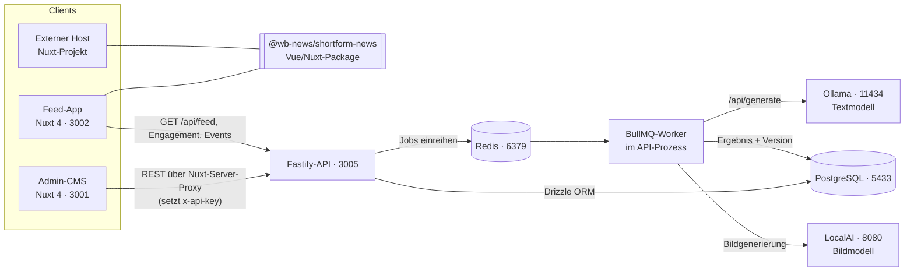
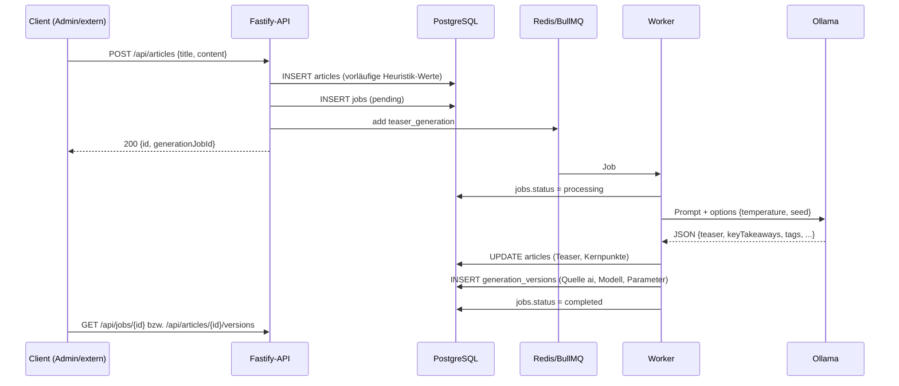
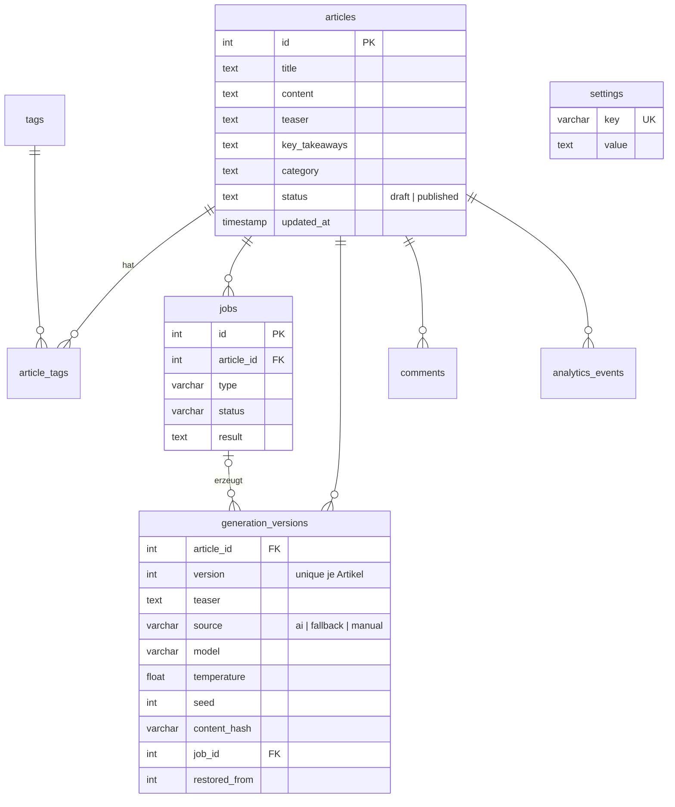

# Architektur – wb-newsfeed

Diese Doku beschreibt die Bausteine und die wichtigsten Abläufe im System.
Die einzelnen Endpunkte mit Parametern und Antworten stehen in
[`apps/api/openapi.yaml`](../apps/api/openapi.yaml) (OpenAPI 3.1). Die Datei lässt sich
z. B. im [Swagger Editor](https://editor.swagger.io) oder mit der OpenAPI-Erweiterung
von VS Code ansehen.

## Bausteine

| Baustein | Aufgabe | Code |
|---|---|---|
| Admin-CMS | Artikel anlegen/bearbeiten, Versionen, Jobs, KI-Einstellungen | `apps/admin` |
| Feed-App | Mobiler Short-Form-Feed, nutzt das Package | `apps/feed` |
| Package | `ShortformFeed`/`ShortformCard`, Events, Styling per CSS-Variablen | `packages/shortform-news` |
| API | REST, Auth, Caching, Einreihen der Generierung | `apps/api/src/routes` |
| Worker | KI-Generierung, Versionierung, Auto-Tagging, Bilder | `apps/api/src/queue/index.ts` |
| Summarizer | Prompt an Ollama, Fallback-Heuristik | `apps/api/src/services/summarizer.ts` |
| Versionen | Versionen schreiben/lesen | `apps/api/src/services/versions.ts` |

## Ablauf: Artikel anlegen und generieren

Die Generierung läuft asynchron. Die API antwortet sofort, der Worker erledigt die KI-Arbeit im Hintergrund.
Egal ob der Artikel über das Admin, `POST /api/articles` oder `POST /api/articles/quick` kommt:
die API reiht den Job selbst ein (`enqueueGeneration`), kein Client muss `/api/jobs` extra aufrufen.

**Regeln im Worker**

- Einen von der Redaktion gesetzten Titel und eine gesetzte Kategorie überschreibt die KI nicht.
  Nur Platzhalter (`[Auto-Titel ausstehend]`, `Auto`/`Allgemein`) werden ersetzt.
- Tags vergibt die KI nur an Artikel, die noch keine haben.
- Ist Ollama nicht erreichbar, liefert die Heuristik (`utils/metadata.ts`) ein Ergebnis. Der Job
  bekommt dann den Zusatz „Fallback ohne KI“, die Version die Quelle `fallback`.

## Ablauf: Inhalt geändert

`PUT /api/articles/{id}` vergleicht den neuen mit dem gespeicherten Stand:

| Änderung | Folge |
|---|---|
| `content` geändert, Teaser nicht | Neuer Job `teaser_generation` (Antwort enthält `generationJobId`) |
| `teaser`/`keyTakeaways` von Hand geändert | Neue Version mit Quelle `manual`, keine Neugenerierung |
| nur Status, Titel, Tags o. Ä. | keine Generierung |

## Versionierung und Reproduzierbarkeit

Jedes Ergebnis landet als **unveränderliche** Zeile in `generation_versions`:
Teaser, Kernpunkte, Titel, Kategorie, Tags, Quelle (`ai`/`fallback`/`manual`),
Modell, `temperature`, `seed`, SHA-256 des Artikeltexts und die Job-ID.

- Die Versionsnummer zählt pro Artikel ab 1. Ein Unique-Constraint auf `(article_id, version)`
  verhindert doppelte Nummern.
- **Wiederherstellen** (`POST /api/articles/{id}/versions/{n}/restore`) kopiert eine alte Version
  zurück in den Artikel und legt dafür eine *neue* Version mit `restoredFrom = n` an.
  Die Historie wird nie umgeschrieben.
- **Reproduzierbar:** Standard ist `temperature = 0` und `seed = 42` (im Admin unter
  Einstellungen änderbar). Gleiches Modell + gleicher Prompt + gleicher Text (`contentHash`)
  ergibt dasselbe Ergebnis. Der Prompt enthält die Liste bestehender Tags, neue Tags verändern ihn.

## Feed-Auslieferung und Caching

`GET /api/feed` ist öffentlich und wird von der Feed-App alle 60 s abgefragt.

1. **Server-Cache:** Die komplette Liste veröffentlichter Artikel samt Tags liegt im Speicher.
   Pro Anfrage läuft nur eine kleine Prüfabfrage (Anzahl und letztes `updated_at` der veröffentlichten
   Artikel, Anzahl und höchste ID der Tag-Zuordnungen). Solange sich die nicht ändert, entfallen
   Artikelabfrage und Tag-Join. Jede Änderung über Drizzle setzt `updated_at`; zusätzlich gilt
   eine Obergrenze von 60 s. Header `X-Feed-Cache: HIT|MISS|BYPASS`.
2. **HTTP-Revalidierung:** Die Antwort trägt ein `ETag` (Hash des Bodys) und `Cache-Control: no-cache`.
   Browser schicken beim nächsten Abruf `If-None-Match` mit. Hat sich nichts geändert, antwortet die
   API mit `304 Not Modified` ohne Body.

Die KI-Arbeit selbst ist über die Queue entkoppelt: langsame Modelle blockieren keine API-Anfrage.

## Authentifizierung

Ein `preHandler`-Hook in `apps/api/src/server.ts` prüft den Header `x-api-key` gegen `API_KEY`.
Ausgenommen sind die Endpunkte, die der anonyme Feed braucht: `/api/feed`, Like/Unlike/Share/Kommentare,
`/api/analytics/events`, `/api/sysinfo` und `/images/`.
Das Admin ruft die API über seinen Nuxt-Server-Proxy (`apps/admin/server/api/[...].ts`) auf,
der den Key serverseitig ergänzt.

## Datenmodell

Löschen eines Artikels entfernt per `ON DELETE CASCADE` Tags-Zuordnungen, Jobs, Versionen,
Kommentare und Events. Schema-Änderungen werden mit `pnpm --filter @wb-news/api run db:push` übernommen.
