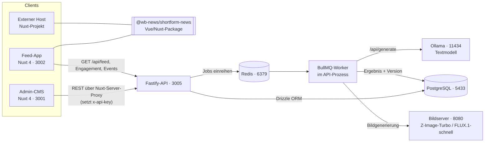
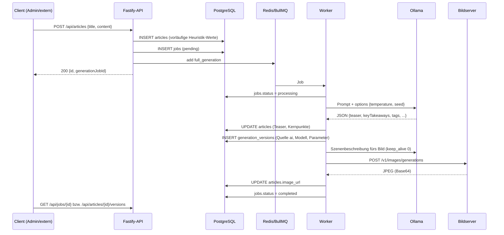
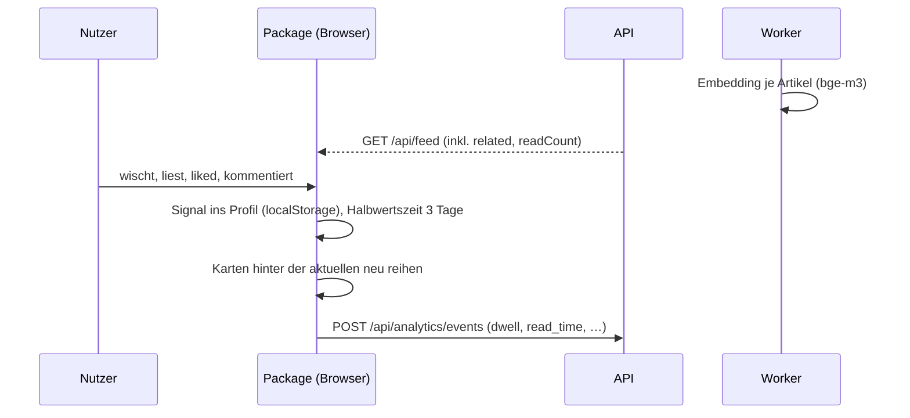
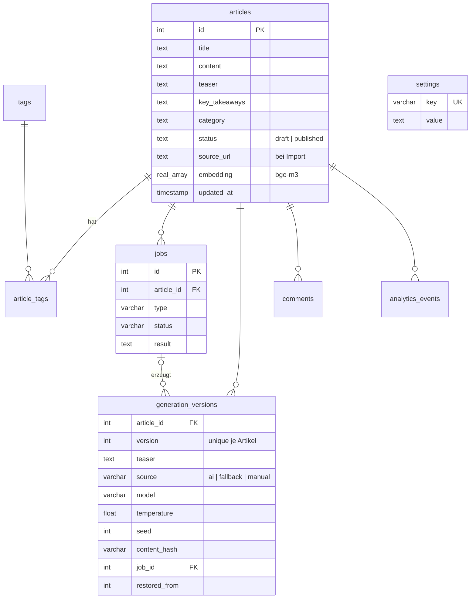

# Architektur – wb-newsfeed

Diese Doku beschreibt die Bausteine und die wichtigsten Abläufe im System.
Die einzelnen Endpunkte mit Parametern und Antworten stehen in
[`apps/api/openapi.yaml`](../apps/api/openapi.yaml) (OpenAPI 3.1). Bei laufender API ist
die Spezifikation unter http://localhost:3005/docs als Swagger UI erreichbar und dort
direkt ausprobierbar.

## Bausteine

```mermaid
graph LR
    subgraph Clients
        A[Admin-CMS<br/>Nuxt 4 · 3001]
        F[Feed-App<br/>Nuxt 4 · 3002]
        H[Externer Host<br/>Nuxt-Projekt]
    end
    P[["@wb-news/shortform-news<br/>Vue/Nuxt-Package"]]
    API[Fastify-API · 3005]
    W[BullMQ-Worker<br/>im API-Prozess]
    DB[(PostgreSQL · 5433)]
    R[(Redis · 6379)]
    O[Ollama · 11434<br/>Textmodell]
    L[Bildserver · 8080<br/>Z-Image-Turbo / FLUX.1-schnell]

    A -- "REST über Nuxt-Server-Proxy<br/>(setzt x-api-key)" --> API
    F -- "GET /api/feed, Engagement, Events" --> API
    F --- P
    H --- P
    API -- Drizzle ORM --> DB
    API -- Jobs einreihen --> R
    R --> W
    W -- /api/generate --> O
    W -- Bildgenerierung --> L
    W -- Ergebnis + Version --> DB
```

| Baustein | Aufgabe | Code |
|---|---|---|
| Admin-CMS | Artikel anlegen/bearbeiten, Bilder, Versionen, Jobs, Modell-Einstellungen | `apps/admin` |
| Feed-App | Mobiler Short-Form-Feed, nutzt das Package | `apps/feed` |
| Package | `ShortformFeed`/`ShortformCard`, Events, Styling per CSS-Variablen | `packages/shortform-news` |
| API | REST, Auth, Caching, Einreihen der Generierung | `apps/api/src/routes` |
| Worker | Text- und Bildgenerierung, Versionierung, Auto-Tagging | `apps/api/src/queue/index.ts` |
| Summarizer | Prompt an Ollama, Fallback-Heuristik | `apps/api/src/services/summarizer.ts` |
| Bildgenerator | Szenenbeschreibung über Ollama, Aufruf des Bildservers | `apps/api/src/services/imageGenerator.ts` |
| Bildserver | Z-Image-Turbo oder FLUX.1-schnell (Python, diffusers), OpenAI-kompatibler Endpunkt | `services/image` |
| Embeddings | bge-m3 über Ollama, ähnliche Artikel für „Für dich“ | `apps/api/src/services/embeddings.ts` |
| Import | RSS/Atom einlesen, Volltext holen, Jobs einreihen | `apps/api/src/services/importer.ts` |
| Personalisierung | Profil, Signale, Sortierung (im Browser) | `packages/shortform-news/src/personalization.ts` |
| Versionen | Versionen schreiben/lesen | `apps/api/src/services/versions.ts` |

## Ablauf: Artikel anlegen und generieren

Die Generierung läuft asynchron. Die API antwortet sofort, der Worker erledigt die Arbeit im Hintergrund.
Neue Artikel ohne Bild bekommen einen `full_generation`-Job (Text und Titelbild), bei geändertem Text
wird nur der Teaser neu erzeugt (`teaser_generation`).
Egal ob der Artikel über das Admin, `POST /api/articles` oder `POST /api/articles/quick` kommt:
die API reiht den Job selbst ein (`enqueueGeneration`), kein Client muss `/api/jobs` extra aufrufen.

```mermaid
sequenceDiagram
    participant C as Client (Admin/extern)
    participant API as Fastify-API
    participant DB as PostgreSQL
    participant Q as Redis/BullMQ
    participant W as Worker
    participant O as Ollama
    participant B as Bildserver

    C->>API: POST /api/articles {title, content}
    API->>DB: INSERT articles (vorläufige Heuristik-Werte)
    API->>DB: INSERT jobs (pending)
    API->>Q: add full_generation
    API-->>C: 200 {id, generationJobId}
    Q->>W: Job
    W->>DB: jobs.status = processing
    W->>O: Prompt + options {temperature, seed}
    O-->>W: JSON {teaser, keyTakeaways, tags, ...}
    W->>DB: UPDATE articles (Teaser, Kernpunkte)
    W->>DB: INSERT generation_versions (Quelle ai, Modell, Parameter)
    W->>O: Szenenbeschreibung fürs Bild (keep_alive 0)
    W->>B: POST /v1/images/generations
    B-->>W: JPEG (Base64)
    W->>DB: UPDATE articles.image_url
    W->>DB: jobs.status = completed
    C->>API: GET /api/jobs/{id} bzw. /api/articles/{id}/versions
```

**Regeln im Worker**

- Einen von der Redaktion gesetzten Titel und eine gesetzte Kategorie überschreibt das Modell nicht.
  Nur Platzhalter (`[Auto-Titel ausstehend]`, `Auto`/`Allgemein`) werden ersetzt.
- Tags vergibt das Modell nur an Artikel, die noch keine haben.
- Ist Ollama nicht erreichbar, liefert die Heuristik (`utils/metadata.ts`) ein Ergebnis. Der Job
  bekommt dann den Zusatz „Fallback“, die Version die Quelle `fallback`.
- Scheitert nur das Bild (Bildserver aus), bleibt der Job trotzdem erfolgreich und vermerkt
  „Bild fehlgeschlagen“. Ein reiner `image_generation`-Job schlägt dagegen fehl und wird von BullMQ wiederholt.

## Ablauf: Inhalt geändert

`PUT /api/articles/{id}` vergleicht den neuen mit dem gespeicherten Stand:

| Änderung | Folge |
|---|---|
| `content` geändert, Teaser nicht | Neuer Job `teaser_generation` (Antwort enthält `generationJobId`) |
| `teaser`/`keyTakeaways` von Hand geändert | Neue Version mit Quelle `manual`, keine Neugenerierung |
| nur Status, Titel, Tags o. Ä. | keine Generierung |

## Versionierung und Reproduzierbarkeit

Jedes Ergebnis landet als **unveränderliche** Zeile in `generation_versions`:
Teaser, Kernpunkte, Titel, Kategorie, Tags, Quelle (`ai`/`fallback`/`manual`),
Modell, `temperature`, `seed`, SHA-256 des Artikeltexts und die Job-ID.

- Die Versionsnummer zählt pro Artikel ab 1. Ein Unique-Constraint auf `(article_id, version)`
  verhindert doppelte Nummern.
- **Wiederherstellen** (`POST /api/articles/{id}/versions/{n}/restore`) kopiert eine alte Version
  zurück in den Artikel und legt dafür eine *neue* Version mit `restoredFrom = n` an.
  Die Historie wird nie umgeschrieben.
- **Reproduzierbar:** Standard ist `temperature = 0` und `seed = 42` (im Admin unter
  Einstellungen änderbar). Gleiches Modell + gleicher Prompt + gleicher Text (`contentHash`)
  ergibt dasselbe Ergebnis. Der Prompt enthält die Liste bestehender Tags, neue Tags verändern ihn.

## Feed-Auslieferung und Caching

`GET /api/feed` ist öffentlich und wird von der Feed-App alle 60 s abgefragt.

1. **Server-Cache:** Die komplette Liste veröffentlichter Artikel samt Tags liegt im Speicher.
   Pro Anfrage läuft nur eine kleine Prüfabfrage (Anzahl und letztes `updated_at` der veröffentlichten
   Artikel, Anzahl und höchste ID der Tag-Zuordnungen). Solange sich die nicht ändert, entfallen
   Artikelabfrage und Tag-Join. Jede Änderung über Drizzle setzt `updated_at`; zusätzlich gilt
   eine Obergrenze von 60 s. Header `X-Feed-Cache: HIT|MISS|BYPASS`.
2. **HTTP-Revalidierung:** Die Antwort trägt ein `ETag` (Hash des Bodys) und `Cache-Control: no-cache`.
   Browser schicken beim nächsten Abruf `If-None-Match` mit. Hat sich nichts geändert, antwortet die
   API mit `304 Not Modified` ohne Body.

Die Generierung selbst ist über die Queue entkoppelt: langsame Modelle blockieren keine API-Anfrage.

## Bildgenerierung

Anbieter laut Einstellung `imageProvider`:

- **local:** eigener Bildserver unter `services/image` (FastAPI, `diffusers`) mit demselben Endpunkt wie
  die OpenAI-Bild-API (`POST /v1/images/generations`). Standardmodell Z-Image-Turbo (Apache 2.0),
  alternativ FLUX.1-schnell (Apache 2.0, Transformer als GGUF Q8_0, T5 in fp8).
- **gemini:** Google Gemini API, z. B. Nano Banana Pro. Der Key kommt nur aus `GEMINI_API_KEY`.

Ablauf beim lokalen Bildserver:

1. **Bildprompt planen** (`planScene`): Entwurf mit Denkmodus (Kernereignis der Schlagzeile, dann
   das passende Pressefoto auf Englisch), danach ein Prüfaufruf gegen die Schlagzeile, der den
   Entwurf bei Bedarf korrigiert (Nebendetail als Motiv, erfundene Orte, Schrift, Gesichter).
   Ohne Ollama geht die Schlagzeile direkt ins Modell. Der Prompt landet in `articles.image_prompt`.
2. **Rendern:** 768 × 1344 Pixel (9:16), fester Seed aus der Artikel-ID.
3. **Speichern:** JPEG unter `apps/api/public/images`, Pfad in `articles.image_url`. Ein ersetztes Bild wird gelöscht.

**Speicher:** Passt das Modell samt Reserve in den freien Grafikspeicher, liegt nur die gerade
rechnende Komponente auf der Karte (`enable_model_cpu_offload`). Sonst werden die Blöcke einzeln
nachgeladen (`enable_group_offload`). Ollama gibt den Speicher nach der Szenenbeschreibung sofort
frei (`keep_alive: 0`). So laufen Text- und Bildmodell nacheinander auf einer 16-GB-Karte.

## Personalisierung („Für dich“)

```mermaid
sequenceDiagram
    participant U as Nutzer
    participant P as Package (Browser)
    participant API as API
    participant W as Worker
    W->>W: Embedding je Artikel (bge-m3)
    API-->>P: GET /api/feed (inkl. related, readCount)
    U->>P: wischt, liest, liked, kommentiert
    P->>P: Signal ins Profil (localStorage), Halbwertszeit 3 Tage
    P->>P: Karten hinter der aktuellen neu reihen
    P->>API: POST /api/analytics/events (dwell, read_time, …)
```

Score je Artikel: Interesse an der Kategorie (×3), an den Tags (×2), Ähnlichkeit zu Artikeln mit
Interesse über `related` (×3), Aktualität mit 24 Stunden Halbwertszeit (×1,5) und Beliebtheit
(×0,7). Gesehene Artikel verlieren 2,5, geöffnete 4 Punkte. Beim Sortieren kostet dieselbe
Kategorie wie auf den beiden Plätzen davor 1,2 × Anzahl², jeder fünfte Platz geht an die
Kategorie mit dem geringsten Interesse. Die Ähnlichkeitslisten berechnet die API beim Aufbau
des Feed-Caches (Kosinus-Ähnlichkeit, ab 0,55, höchstens 8 je Artikel).

## Import

`POST /api/import/rss` liest RSS 1.0 (RDF), RSS 2.0 und Atom. Neue Einträge (erkannt an
`articles.source_url`) werden mit Kategorie `Auto` angelegt und bekommen einen
`full_generation`-Job. Mit `fullText` holt der Import die Absätze aus dem Hauptinhalt der
Artikelseite.

## Authentifizierung

Ein `preHandler`-Hook in `apps/api/src/server.ts` prüft den Header `x-api-key` gegen `API_KEY`.
Ausgenommen sind die Endpunkte, die der anonyme Feed braucht: `/api/feed`, Like/Unlike/Share/Kommentare,
`/api/analytics/events`, `/api/sysinfo`, `/images/` und die Doku unter `/docs`.
Ohne `API_KEY` in der `.env` startet die API nicht.
Das Admin ruft die API über seinen Nuxt-Server-Proxy (`apps/admin/server/api/[...].ts`) auf,
der den Key serverseitig ergänzt.

## Datenmodell

```mermaid
erDiagram
    articles ||--o{ article_tags : hat
    tags ||--o{ article_tags : ""
    articles ||--o{ jobs : ""
    articles ||--o{ generation_versions : ""
    jobs |o--o{ generation_versions : erzeugt
    articles ||--o{ comments : ""
    articles ||--o{ analytics_events : ""

    articles {
        int id PK
        text title
        text content
        text teaser
        text key_takeaways
        text category
        text status "draft | published"
        text source_url "bei Import"
        real_array embedding "bge-m3"
        timestamp updated_at
    }
    generation_versions {
        int article_id FK
        int version "unique je Artikel"
        text teaser
        varchar source "ai | fallback | manual"
        varchar model
        float temperature
        int seed
        varchar content_hash
        int job_id FK
        int restored_from
    }
    jobs {
        int id PK
        int article_id FK
        varchar type
        varchar status
        text result
    }
    settings {
        varchar key UK
        text value
    }
```

Löschen eines Artikels entfernt per `ON DELETE CASCADE` Tags-Zuordnungen, Jobs, Versionen,
Kommentare und Events. Schema-Änderungen werden mit `pnpm --filter @wb-news/api run db:push` übernommen.
